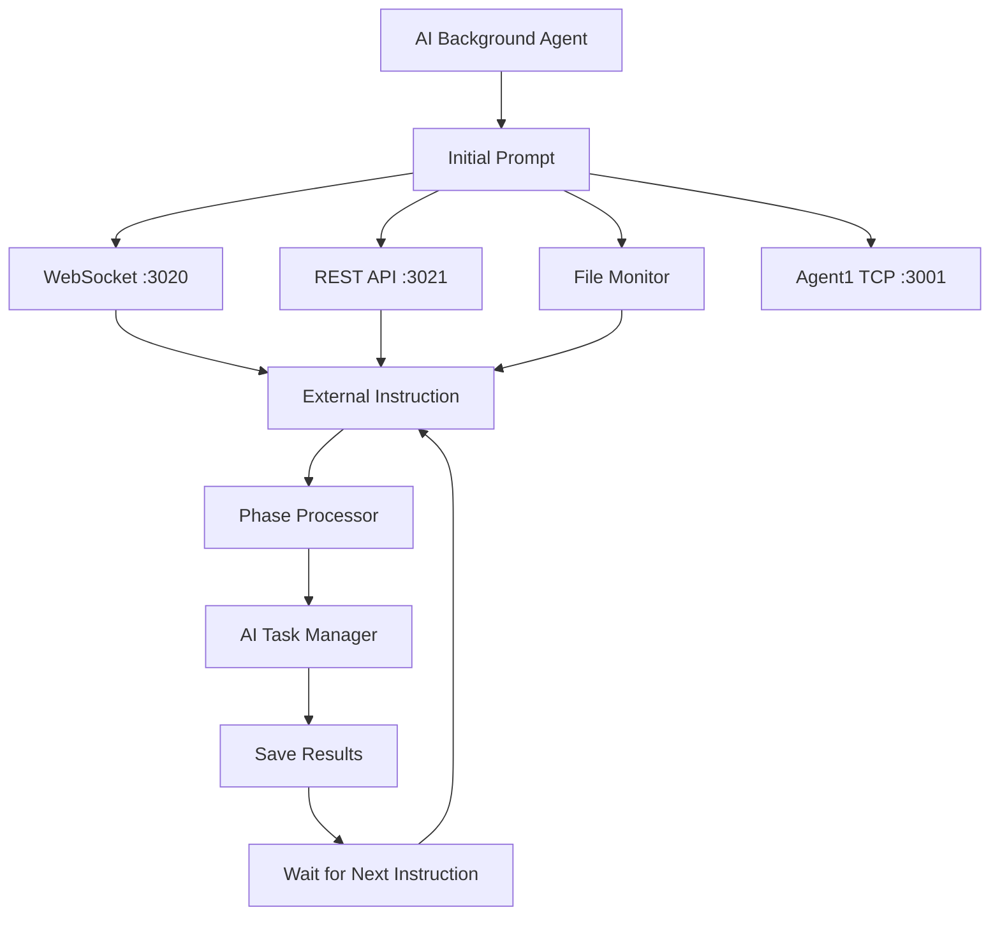

# AI Background Agent v4.0

Продвинутая система AI агентов с поддержкой Initial Prompt, внешних инструкций и фазовой обработки задач.

## 🚀 Возможности

- **AI Background Agent (Agent2)** с расширенным функционалом:
  - ✅ Выполнение Initial Prompt при запуске
  - ✅ Прием внешних инструкций через WebSocket, REST API и файлы
  - ✅ Фазовая обработка задач (phase-1, phase-2, etc.)
  - ✅ Непрерывная работа без завершения
  - ✅ Сохранение результатов каждой фазы

- **TCP соединение с Agent1** (совместимость)
- **Логирование и мониторинг**
- **Гибкие интерфейсы для взаимодействия**

## 📁 Структура проекта

```
backgroundAgent/
├── cursor-agent.js                 # Agent1 (TCP сервер)
├── cursor-agent-secondary.js       # AI Background Agent (Agent2)
├── package.json                    # Зависимости и скрипты
├── logs/                          # Логи агентов
├── instructions/                  # Входящие инструкции (файлы .txt)
└── results/                       # Результаты выполнения фаз
```

## 🏃‍♂️ Быстрый старт

### 1. Запуск AI Background Agent

```bash
# Основной способ
npm run ai-agent

# Альтернативные способы
npm run agent2
npm run start:ai-agent
npm run run:ai-agent
```

### 2. Запуск с Agent1 (опционально)

В отдельном терминале:
```bash
npm run agent1
# или
npm run start:agent1
```

## 📡 Интерфейсы для внешних инструкций

### 1. WebSocket (порт 3020)

```javascript
const WebSocket = require('ws');
const ws = new WebSocket('ws://localhost:3020');

ws.on('open', () => {
    ws.send('Проанализировать файловую систему проекта');
});

ws.on('message', (data) => {
    console.log('Ответ:', JSON.parse(data));
});
```

### 2. REST API (порт 3021)

**Отправить инструкцию:**
```bash
curl -X POST http://localhost:3021/instruction \
  -H "Content-Type: application/json" \
  -d '{"instruction": "Создать отчет о состоянии системы"}'
```

**Получить статус агента:**
```bash
curl http://localhost:3021/status
```

### 3. Файловый мониторинг

Создайте `.txt` файл в папке `instructions/`:

```bash
echo "Выполнить анализ производительности" > instructions/task1.txt
```

Файл будет автоматически обработан и перемещен в `results/`.

## 🎯 Жизненный цикл агента

1. **Инициализация** 
   - Создание директорий (logs/, instructions/, results/)
   - Запуск внешних интерфейсов (WebSocket, REST, File monitor)
   
2. **Подключение к Agent1** (если доступен)
   - TCP подключение на порт 3001
   - Хэндшейк с Agent1
   
3. **Выполнение Initial Prompt**
   - AI анализ системы (2 секунды)
   - Сохранение результата в results/initial-*.json
   
4. **Ожидание внешних инструкций**
   - Прием через WebSocket/REST/File
   - Обработка как новые фазы
   - Сохранение результатов

5. **Непрерывная работа**
   - Агент НЕ завершается после Initial Prompt
   - Ждет новые инструкции бесконечно
   - Каждая инструкция = новая фаза (phase-1, phase-2, etc.)

## 📊 Мониторинг

### Логи
Все действия логируются в `logs/ai-agent2-*.log`:
```
[2025-01-31T...] [STEP-1] [AI-Agent2] [waiting_instructions] [initial] [UPTIME:45s] ⏳ Ожидание инструкций...
```

### Статус агента
```bash
curl http://localhost:3021/status
```

Возвращает:
```json
{
  "agentId": "AI-Agent2",
  "status": "waiting_instructions",
  "currentPhase": "initial", 
  "tasksCompleted": 0,
  "uptime": 45,
  "interfaces": {
    "websocket": "active",
    "rest": "active", 
    "file": "active"
  },
  "agent1Connection": {
    "isConnected": true,
    "handshakeComplete": true
  }
}
```

## 🔧 Конфигурация

### Порты
- **Agent1 TCP:** 3001
- **WebSocket:** 3020  
- **REST API:** 3021

### Initial Prompt
Можно изменить в коде (`AITaskManager.initialPrompt`):
```javascript
this.initialPrompt = "Ваша стартовая AI инструкция";
```

## 📋 Примеры использования

### 1. Базовое тестирование
```bash
# Запуск агента
npm run ai-agent

# В другом терминале - отправка инструкции
curl -X POST http://localhost:3021/instruction \
  -H "Content-Type: application/json" \
  -d '{"instruction": "Привет! Выполни тестовую задачу"}'
```

### 2. Файловые инструкции
```bash
# Создание инструкции
echo "Проанализировать папку logs и подсчитать количество файлов" > instructions/analyze_logs.txt

# Агент автоматически обработает файл
# Результат появится в results/processed-*-analyze_logs.txt
```

### 3. WebSocket в реальном времени
```javascript
const WebSocket = require('ws');
const ws = new WebSocket('ws://localhost:3020');

ws.on('open', () => {
    console.log('Подключен к AI Agent');
    
    // Отправляем последовательность инструкций
    setTimeout(() => ws.send('Фаза 1: Инициализация'), 1000);
    setTimeout(() => ws.send('Фаза 2: Анализ данных'), 3000);
    setTimeout(() => ws.send('Фаза 3: Генерация отчета'), 5000);
});

ws.on('message', (data) => {
    const response = JSON.parse(data);
    console.log('Фаза выполнена:', response);
});
```

## 🛑 Остановка

```bash
# Ctrl+C в терминале с агентом
# или
pkill -f "node cursor-agent-secondary.js"
```

## 🔍 Отладка

### Проверка логов
```bash
tail -f logs/ai-agent2-*.log
```

### Проверка интерфейсов
```bash
# WebSocket
curl -I http://localhost:3020

# REST API  
curl http://localhost:3021/status

# Файловый мониторинг
ls -la instructions/ results/
```

## 🏗️ Архитектура



Агент работает в непрерывном цикле, обрабатывая каждую новую инструкцию как отдельную фазу задачи. 